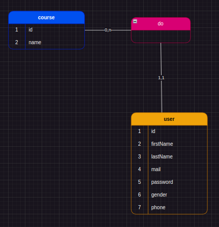

# Spring Boot Project with JDBC 
## Project final exam PROG2 
`E-learning application` The role of this application is to generate online courses.
 
## MCD
`Old Version`

`New Version`

## Required
If you want to apply this project, this requires using and
installing some dependencies like this :
- PostgreSQL 15 
- Java 17.0.8
- Maven Apache

## Configuration
Before starting, You should execute the `data.sql` in the ressource on `/src/main/ressources/applicaion.properities`
And now change this variable inside.

`-DB_URL => jdbc:postgresql://localhost:5432/{{database_name}}`

`-DB_USERNAME => {{user_name_of_postgresql}}`

`-DB_PASSWORD => {{password_of_postgresql}}`
